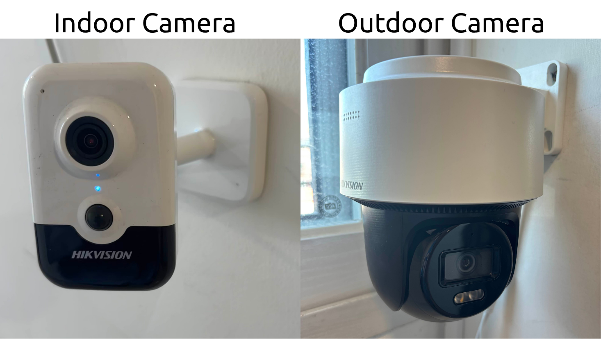

---
date:
  created: 2025-11-13T15:00:00+09:00
  updated: 2025-11-13T15:50:00+09:00
authors:
  - inokov
categories:
  - Tech Blog
tags:
  - Computer Vision
  - Camera specification
  - Tech Guide
---

# Choosing the Right Camera for CV Application

When building a face recognition–based attendance system, the camera is not just an accessory — it's the foundation of your entire pipeline. Even the best recognition model can fail if the camera feed is noisy, blurred, or poorly lit. Choosing the right camera requires balancing image quality, cost, and computational performance.

<!-- more -->

Let's walk through what to consider before buying, which specs matter most, and how to find the right balance for your use case.
Understand the Application Context
Before comparing specs, think carefully about where and how your camera will be installed — the environment drives nearly every other decision.
Face recognition for attendance can happen in two broad contexts: indoor and outdoor. Each has its own design considerations.

## Indoor Installations

Indoor locations such as offices, schools, or factory floors generally have controlled lighting and are physically secure.

- Here, compact "cube" or mini-dome cameras work best — they blend easily into the environment and save space.
- Since tampering risk is low, reset-button security is less critical.
- Focus instead on good field-of-view coverage and stable lighting near the entry area.
- Still, consider adding soft ambient or IR lighting if operation continues into the night — consistent illumination keeps face features sharp for recognition.

## Outdoor Installations

Outdoor entrances, gates, or parking areas add new challenges — weather, lighting variation, and security.

- Choose weather-resistant (IP66/IP67-rated) housings that can withstand rain, dust, and temperature shifts.
- Prefer dome or bullet-style PoE IP cameras; domes hide lens direction and are harder to tamper with.
- The reset button and ports should not be easily accessible from outside — this prevents unauthorized factory resets.
- Ensure night-time visibility through either integrated IR LEDs or external lighting.
- If sunlight causes backlighting issues, enable WDR (Wide Dynamic Range) to maintain face detail.

## Key Camera Specs That Impact Face Recognition
Choosing a camera for face recognition isn’t about chasing the highest megapixel count — it’s about finding the balance between clarity, consistency, and computational efficiency. Every specification affects how well your system captures usable facial data and how heavy that stream will be to process on the server.

Start with resolution. For most attendance setups, a 2 to 4 megapixel (1080p–1440p) camera can provide enough detail to extract accurate facial embeddings at a 2–5 meter distance. Higher resolutions like 4K may look impressive but can double your bandwidth and GPU load without improving recognition quality proportionally. 

Next, check the frame rate. Around 25 to 30 frames per second is ideal — fast enough to capture people as they move naturally, while avoiding motion blur. Going beyond that rarely improves recognition but increases streaming and storage costs.

A good CMOS sensor, performs well in low-light indoor scenes and offers strong dynamic range. Combine this with WDR (Wide Dynamic Range) support — at least 120 dB if available — to handle tricky lighting like bright entrances or mixed daylight.

The lens defines how your scene is framed. A 2.8 mm–4 mm lens gives a wide enough view for entrances, allowing multiple people to be seen clearly at typical working distances. Varifocal lenses are worth the small extra cost if you expect to fine-tune placement later.

Finally, consider network and compression. Cameras supporting H.265 or H.265+ codecs reduce bandwidth and storage needs significantly compared with older H.264 streams. If you can, prefer PoE (Power-over-Ethernet) models — they simplify installation, needing just a single cable for both power and data.
